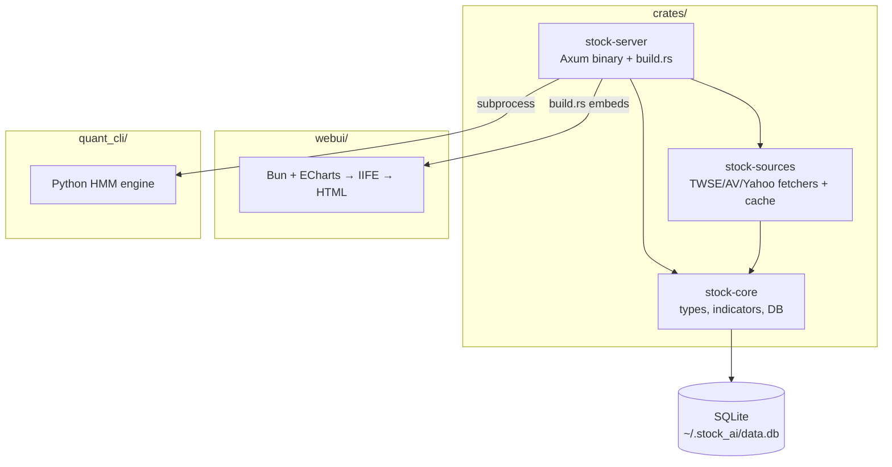

# Stock AI — Phase 1

Foundation Complete · Watchlist & Polish Next

<div class="pt-12">
  <span @click="$slidev.nav.next" class="px-2 py-1 rounded cursor-pointer" hover="bg-white bg-opacity-10">
    Press Space for next page <carbon:arrow-right class="inline"/>
  </span>
</div>

<div class="abs-br m-6 flex gap-2 text-xl opacity-50">
  Stock AI · Phase 1 Progress
</div>

---
transition: fade-out
---

# Agenda

<Toc minDepth="1" maxDepth="1" />

---
layout: center
---

# Progress Snapshot

<div grid="~ cols-3 gap-8" class="mt-8">

<div class="text-center">
  <div class="text-6xl font-bold text-green-400">10</div>
  <div class="mt-2 text-lg opacity-80">Foundation Done</div>
</div>

<div class="text-center">
  <div class="text-6xl font-bold text-yellow-400">7</div>
  <div class="mt-2 text-lg opacity-80">Watchlist Tasks</div>
</div>

<div class="text-center">
  <div class="text-6xl font-bold text-blue-400">4</div>
  <div class="mt-2 text-lg opacity-80">Polish Tasks</div>
</div>

</div>

<div class="mt-12 text-center text-lg opacity-60">
  21 total tasks · 48% complete · Foundation solid, features incoming
</div>

<style>
h1 {
  background-color: #2B90B6;
  background-image: linear-gradient(45deg, #4EC5D4 10%, #146b8c 20%);
  background-size: 100%;
  -webkit-background-clip: text;
  -moz-background-clip: text;
  -webkit-text-fill-color: transparent;
  -moz-text-fill-color: transparent;
}
</style>

---

# Current System — What's Built

<v-clicks>

- **Rust workspace** — 3 crates (stock-core, stock-sources, stock-server) serving REST API on `:3003`
- **Embedded web UI** — Bun + ECharts, candlestick + volume + dataZoom, built into binary
- **Python HMM engine** — regime detection, day-trade backtest, standalone HTML reports
- **SQLite cache** — local OHLCV data at `~/.stock_ai/data.db`
- **Multi-tab UI** — stock tabs, sidebar stats (price/change/RSI/MACD), backtest panel
- **3 data sources** — TWSE OpenAPI, Alpha Vantage, Yahoo Finance with smart fallback

</v-clicks>

<style>
h1 {
  background-color: #2B90B6;
  background-image: linear-gradient(45deg, #4EC5D4 10%, #146b8c 20%);
  background-size: 100%;
  -webkit-background-clip: text;
  -moz-background-clip: text;
  -webkit-text-fill-color: transparent;
  -moz-text-fill-color: transparent;
}
</style>

---

# Architecture — Cargo Workspace



<v-click>

One `cargo build` produces a single binary with everything — frontend, API, Python bridge.

</v-click>

---

# Foundation — Completed (10/10)

<div grid="~ cols-2 gap-4">

<div>

### Backend
- [x] Cargo workspace (3 crates)
- [x] SQLite cache (`kline_daily` with PK)
- [x] 7 API endpoints
- [x] Start/stop scripts

</div>

<div>

### Frontend & Quant
- [x] ECharts candlestick + volume + dataZoom
- [x] Stock tabs (multi-symbol)
- [x] Sidebar stats (price, change, RSI, MACD)
- [x] HMM backtest panel (regime states + trade log)
- [x] HTML report generation (standalone ECharts)
- [x] Python HMM CLI (analyze/train/backtest/report)

</div>

</div>

---

# Next: Watchlist Feature (0/7)

<div grid="~ cols-2 gap-8">

<div>

### What
Persistent stock registry — add, remove, quick-switch between watched symbols.

### Why
- Currently hardcoded `loadStock("2330.TW")`
- No way to save favorite stocks
- Manual symbol entry every time

</div>

<div>

### Tasks
1. SQLite `watchlist` table
2. `GET /api/watchlist` — list all
3. `POST /api/watchlist` — add symbol
4. `DELETE /api/watchlist/:symbol` — remove
5. Sidebar panel (click to load, × to remove)
6. Auto-load first stock on boot
7. Pre-populate Taiwan favorites

</div>

</div>

---

# Watchlist — UI Mockup

```
┌─────────────────────────────────────────────────┐
│ Watchlist [+Add]                     [collapse] │
├─────────────────────────────────────────────────┤
│ 2330.TW  台積電   935.0  ▲ +1.2%    [×]        │
│ 2317.TW  鴻海     152.5  ▼ -0.3%    [×]        │
│ 2454.TW  聯發科   1480   ▲ +2.1%    [×]        │
│ 2308.TW  台達電   375.0  ▲ +0.5%    [×]        │
│ 2891.TW  中信金    28.6  ─  0.0%    [×]        │
└─────────────────────────────────────────────────┘
```

<v-click>

**Add dialog:** Symbol input → auto-detect market (.TW → TW, else US) → POST to save

</v-click>

---

# Next: Polish (0/4)

| Task | Description | Impact |
|------|-------------|--------|
| Custom `AppError` | Proper `IntoResponse` for clean JSON errors | DX |
| Cache staleness | Re-fetch if latest bar is too old | Data quality |
| Indicator overlays | RSI/MACD subplots on main chart | Analysis |
| Responsive layout | Mobile-friendly sidebar + chart | Usability |

---

# API Routes — Complete Map

| Method | Path | Purpose | Status |
|--------|------|---------|--------|
| GET | `/` | Embedded web UI | ✅ |
| GET | `/api/history/:symbol?days=N` | OHLCV bars | ✅ |
| GET | `/api/quote/:symbol` | Latest quote | ✅ |
| GET | `/api/indicators/:symbol` | RSI, MACD, BB | ✅ |
| GET | `/api/kline/:symbol?period=&from=&to=` | Filtered kline | ✅ |
| GET | `/api/backtest/:symbol?period=&states=` | HMM analysis | ✅ |
| GET | `/api/report/:symbol` | HTML report | ✅ |
| GET | `/api/watchlist` | List watched symbols | ☐ |
| POST | `/api/watchlist` | Add symbol | ☐ |
| DELETE | `/api/watchlist/:symbol` | Remove symbol | ☐ |

---

# Data Sources

<div grid="~ cols-2 gap-8">

<div>

| Ticker | Primary | Fallback |
|--------|---------|----------|
| `*.TW`, `*.TWO` | TWSE OpenAPI | Yahoo Finance |
| Others | Alpha Vantage | Yahoo Finance |

</div>

<div>

### Cache Flow
1. Check SQLite for cached bars
2. If fresh → return immediately
3. If stale → fetch delta, upsert
4. If empty → fetch full range, store
5. All sources → same `Bar` format

</div>

</div>

---

# Tech Stack Summary

<div grid="~ cols-3 gap-4">

<div class="border rounded p-4">

### Backend
- Rust + Axum
- reqwest (HTTP)
- rusqlite (SQLite)
- serde + chrono

</div>

<div class="border rounded p-4">

### Frontend
- Bun (bundler + runtime)
- TypeScript
- ECharts (candlestick, volume)
- Embedded in binary

</div>

<div class="border rounded p-4">

### Quant
- Python 3.9+
- hmmlearn (HMM)
- pandas + numpy
- yfinance

</div>

</div>

<div class="mt-8 text-center opacity-60">
  Single `cargo build` → one binary with everything included.
</div>

---

# quant_cli → stock_api_cli (Phase 2)

<div grid="~ cols-2 gap-8">

<div>

### Current: quant_cli/
```
sources/  → yfinance, alpha_vantage
features.py → log_ret, range, vol
hmm_model.py → fit, describe, save
backtest.py → day-trade sim
report.py → HTML generation
```

</div>

<div>

### Target: stock_api_cli/
```
yahoo_finance/python/client.py
alpha_vantage/python/client.py
hmm/ → model, features, backtest
bench.py → cross-vendor comparison
→ Phase 3: Bun/TS + Rust clients
```

</div>

</div>

<v-click>

**New:** `bench` command compares vendors for same symbol (latency, bar count, freshness)

</v-click>

---

# Roadmap

<v-clicks>

- **Phase 1 (current)** — Watchlist UI + Polish → make it immediately useful
- **Phase 2** — stock_api_cli restructure, multi-vendor bench, TWSE OpenAPI Python client
- **Phase 3** — Bun/TS + Rust data clients, strategy engine foundation
- **Phase 4** — Full backtesting with performance reporting
- **Phase 5** — Real-time data streaming, paper trading
- **Phase 6** — Production deployment, monitoring, CI/CD

</v-clicks>

<style>
h1 {
  background-color: #2B90B6;
  background-image: linear-gradient(45deg, #4EC5D4 10%, #146b8c 20%);
  background-size: 100%;
  -webkit-background-clip: text;
  -moz-background-clip: text;
  -webkit-text-fill-color: transparent;
  -moz-text-fill-color: transparent;
}
</style>

---
layout: center
class: text-center
---

# Next Step: Watchlist

<div class="mt-8 text-2xl opacity-80">
  docs/plan/stock-registry-ui.md · 7 tasks · Let's go
</div>

<div class="mt-4 text-sm opacity-50">
  docs/plan/phase1-todo.md → full checklist
</div>
